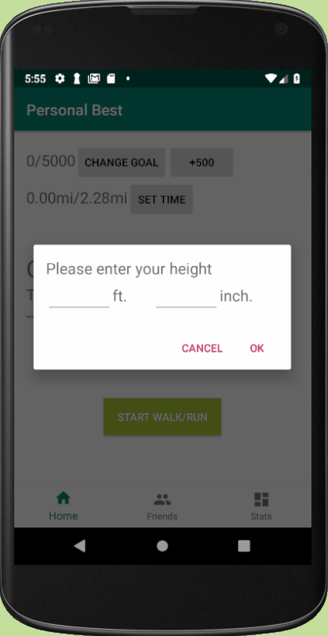
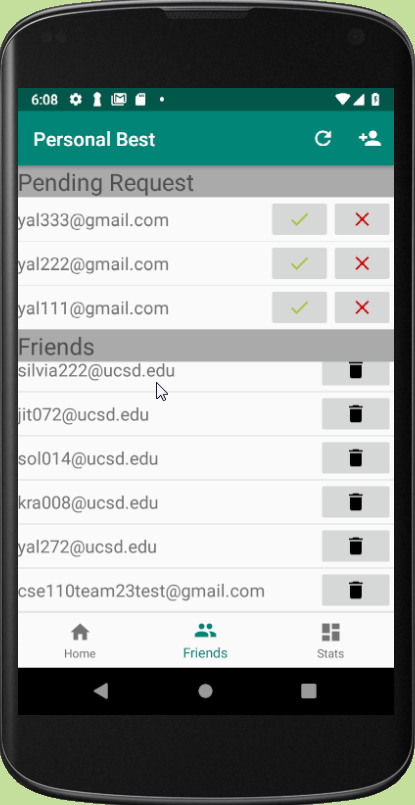
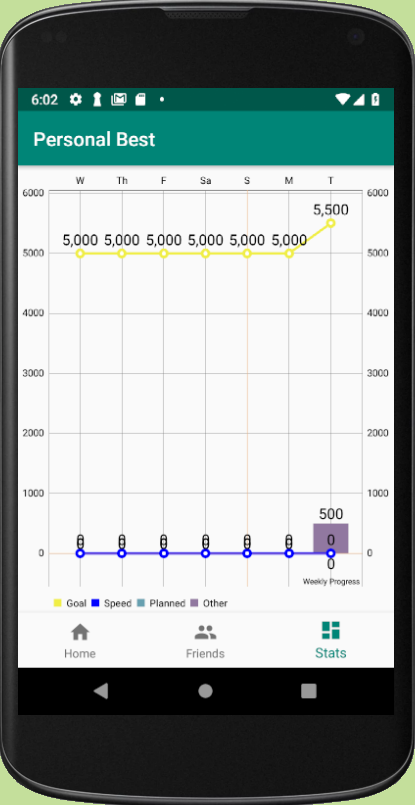
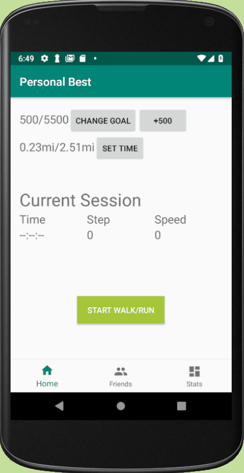
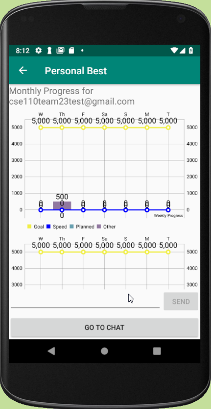
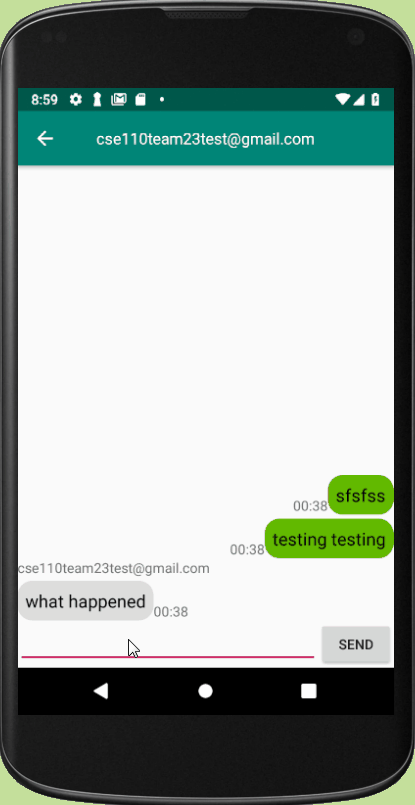

# Personal Best
> An Android app for fitness tracking and encouragement

This is the class project developed by Team 23 for CSE 110, Software Engineering class in UCSD.

Personal Best is an Android app for people who want to get more fit but are sensitive to cost or don't want to wear a (geeky) watch.  It not only tracks your activity and progress, but encourages you to take your fitness to the next level. Some key features and functionailties are:

* Intentional Walking/Run Session with Stats and Summary
* Daily/Weekly/Monthly Activity Summary
* Live Chat/Encouragement with Friends

**Technologies:** Java, Android, Google Fit API, Firebase Cloud Firestore, Firebase Messaging  
**Tools:** Android Studio, ZenHub, CircleCI, git  
**Testing:** JUnit, Espreso, Robolectric, Unit Testing, Object Mocking, UI Testing  
**Design Patterns:** Strategy, Adapter, Observer, Factory Method, Builder, Mediator, MVP  

## Team
* Jiawei Tang - [@Jiawei-Tang-0820](https://github.com/Jiawei-Tang-0820)
* Yang Liu - [@shabbyowen](https://github.com/shabbyowen)
* Songlin Li - [@Vincent-Li-9701](https://github.com/Vincent-Li-9701)
* Jinrong Gong - [@SilviaJIR](https://github.com/SilviaJIR)
* Kyle Anderson - [@kra008](https://github.com/kra008)
* Haaris Tahir-Kheli - [@oneofthem999](https://github.com/oneofthem999)

## Screenshots & Usages

Home Screen                       |  Friend List                     | Weekly Progress
| :-----------------------------: | :------------------------------: | :----------------------------------: |
|  |  |  |

  Walking session              | Friend's Monthly Summary             |  Live Chat
| :--------------------------: | :----------------------------------: | :-----------------------: |
|  |  |  |